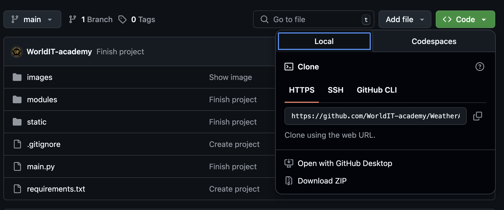
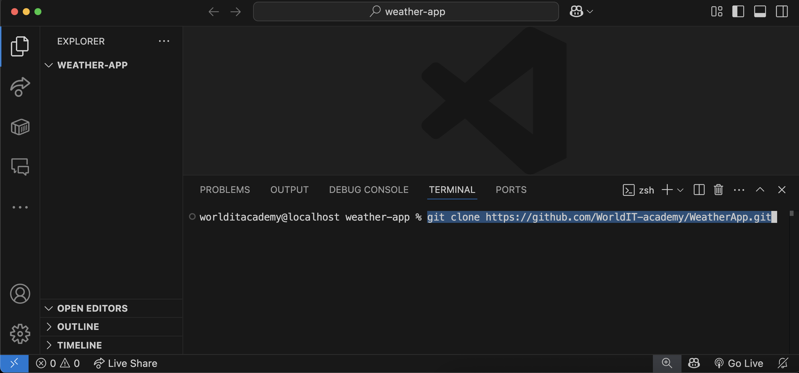

# WEATHER APPLICATION

Цей проект розроблено з метою ознайомлення із роботою API, принципом отримання даних від віддаленого серверу, вмінням їх обробляти, структурувати та застосовувати у своємо проєкті. А саме застосовувалось API такого веб-ресурсу як [OpenWeatherMap](https://openweathermap.org). Проєкт допоможе розібратися із роботою файлів JSON, як правильно отримувати та зберігати дані у файлах з типом .json. Та познайомити користувача з інтерфейсом застосунку розробленим за допомогою пакету [CustomTkinter](https://customtkinter.tomschimansky.com)

### Зміст:
- [Основні модулі проєкту](#modules)
- [Розгортання проєкту](#download)
- [Створення віртуального оточення проєкту](#venv)
- [Завантаження модулей до віртуального оточення](#download-venv)
- [Старт проєкту](#start-project)
- [Основні механіки проєкту](#mechanics)
- [Висновок по проєкту](#result)

### Modules:
Всі модулі
1. [customtkinter](https://customtkinter.tomschimansky.com)
2. [json](https://docs.python.org/3/library/json.html)
3. [colorama](https://pypi.org/project/colorama/)
4. [os](https://docs.python.org/uk/3.13/library/os.html)
5. [requests](https://pypi.org/project/requests/)
6. [pillow](https://pypi.org/project/pillow/)
7. [datetime](https://docs.python.org/3/library/datetime.html)

### Download:
Завантаження проєкту
- ##### Git clone:

    - Отримати посилання для клонування проєкту

    

    - Відкрити VSCode --> у Explorer VSCode відкрити папку для збереження склонованого проєкту --> та у Terminal прописати команду: 
    - `git clone https://github.com/WorldIT-academy/WeatherApp.git`

    

    - Відкрити каталог, який ви склонували у Explorer VSCode
    
- ##### Download ZIP

### Venv:
Створення віртуального оточення

### Download venv:
Завантаження модулів до venv

### Start project:
Cтарт проєкту

### Mechanics:
Основні механіки проєкту

### Result:
Висновок
